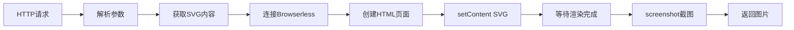

# SVG2IMG 技术设计方案 (简化版)

## 1. 项目概述

SVG2IMG 是一个轻量级的边缘函数服务，专注于将 SVG 转换为图片。设计原则：**简单、直接、无状态**。

## 2. 项目结构

```
├── index.ts          # 主入口文件，HTTP 服务和 SVG 渲染逻辑
├── config.ts         # 配置管理（三级配置系统）
├── deps.ts          # 统一依赖管理
├── utils.ts         # 工具函数（参数解析、错误处理、SVG 处理）
├── test.ts          # 测试文件
├── .env.example     # 环境变量配置示例
└── docs/            # 文档目录
    ├── technical-design.md    # 技术设计方案
    └── implementation.md      # 实施计划
```

## 3. 核心技术方案

### 3.1 依赖选择
- **puppeteer-core**: 连接 browserless，不下载 Chrome 二进制
- **Deno 原生 HTTP**: 使用 `serve()` 处理请求

### 3.2 SVG 转图片流程



### 3.3 核心实现原理

1. **连接 Browserless**:
   ```typescript
   const browser = await puppeteer.connect({
     browserWSEndpoint: `${BROWSERLESS_URL}?token=${TOKEN}`
   });
   ```

2. **SVG 渲染**:
   ```typescript
   const page = await browser.newPage();
   await page.setContent(htmlTemplate); // HTML包含SVG
   await page.waitForTimeout(waitTime); // 等待字体/样式加载
   const screenshot = await page.screenshot(options);
   ```

3. **HTML 模板**:
   ```html
   <!DOCTYPE html>
   <html>
   <head>
     <meta charset="utf-8">
     <style>
       body { margin: 0; padding: 0; background: ${backgroundColor}; }
       svg { display: block; }
     </style>
   </head>
   <body>${svgContent}</body>
   </html>
   ```

## 4. API 设计

### 4.1 GET 请求
```
GET /{svg-url}?scale={number}&format={string}&width={number}&height={number}
```

**URL 解析逻辑**:
- 从请求路径中提取 SVG URL
- 支持完整 URL：`/https://example.com/icon.svg`
- 避免 URL 编码问题

### 4.2 POST 请求
```json
{
  "svg": "<svg>...</svg>",
  "format": "png|jpg|webp|pdf",
  "scale": 1,
  "width": 800,
  "height": 600,
  "quality": 90,
  "background_color": "#ffffff",
  "waitFor": 1000,
  "return_type": "binary|url",
  "url_expiry": 3600
}
```

## 5. 配置管理

使用 `config.ts` 作为配置中心，支持三级配置优先级：

```typescript
// 配置覆盖接口
interface ConfigOverrides {
  USE_SELF_HOSTED?: string;
  BROWSERLESS_TOKEN?: string;
  DEFAULT_FORMAT?: string;
  // ... 更多配置项
}

// 配置覆盖 - 可直接在这里设置值
const overrides: ConfigOverrides = {
  // USE_SELF_HOSTED: "false",
  // BROWSERLESS_TOKEN: "your-token",
};

// 动态配置对象
export const CONFIG = {
  // Browserless 配置
  BROWSERLESS: {
    USE_SELF_HOSTED: parseBoolean(getEnvValue('USE_SELF_HOSTED'), false),
    SELF_HOSTED_URL: getEnvValue('BROWSERLESS_SELF_HOSTED_URL', 'ws://localhost:3000'),
    CLOUD_URL: getEnvValue('BROWSERLESS_CLOUD_URL', 'wss://production-sfo.browserless.io'),
    get TOKEN(): string {
      return tokenManager.getAvailableToken();
    },
    TOKENS: tokenManager.getAllTokens(),
    markTokenFailed: (token: string) => tokenManager.markTokenFailed(token),
  },
  
  // 默认参数
  DEFAULTS: {
    FORMAT: getEnvValue('DEFAULT_FORMAT', 'png') as ImageFormat,
    SCALE: parseNumber(getEnvValue('DEFAULT_SCALE'), 1),
    QUALITY: parseNumber(getEnvValue('DEFAULT_QUALITY'), 90),
    BACKGROUND_COLOR: getEnvValue('DEFAULT_BACKGROUND_COLOR', '#ffffff'),
    WAIT_FOR: parseNumber(getEnvValue('DEFAULT_WAIT_FOR'), 1000),
    RETURN_TYPE: getEnvValue('DEFAULT_RETURN_TYPE', 'binary') as 'binary' | 'url',
    URL_EXPIRY: parseNumber(getEnvValue('DEFAULT_URL_EXPIRY'), 3600),
  },
  
  // 限制参数 - 防止滥用
  LIMITS: {
    MAX_WIDTH: parseNumber(getEnvValue('MAX_WIDTH'), 2048),
    MAX_HEIGHT: parseNumber(getEnvValue('MAX_HEIGHT'), 2048),
    MAX_SVG_SIZE: parseNumber(getEnvValue('MAX_SVG_SIZE'), 1024 * 1024), // 1MB
    TIMEOUT: parseNumber(getEnvValue('TIMEOUT'), 30000), // 30秒
  },

  // 安全配置
  SECURITY: {
    ALLOWED_DOMAINS: parseArray(getEnvValue('ALLOWED_DOMAINS'), []),
    BLOCKED_DOMAINS: parseArray(getEnvValue('BLOCKED_DOMAINS'), ['localhost', '127.0.0.1']),
  },

  // 服务器配置
  SERVER: {
    PORT: parseNumber(getEnvValue('PORT'), 8000),
  },
  
  // Supabase Storage 配置
  STORAGE: {
    SUPABASE_URL: getEnvValue('SUPABASE_URL'),
    SUPABASE_ANON_KEY: getEnvValue('SUPABASE_ANON_KEY'),
    BUCKET: getEnvValue('SUPABASE_STORAGE_BUCKET', 'svg-images'),
  },
};
```

## 6. 错误处理

简化的错误处理策略：

- **400**: 参数错误
- **404**: SVG URL 无法访问
- **422**: SVG 内容无效
- **408**: 渲染超时
- **500**: 内部错误

## 7. 性能考虑

1. **无连接池**: 每次请求独立创建浏览器实例
2. **超时控制**: 避免长时间阻塞
3. **内存管理**: 及时关闭浏览器实例
4. **资源限制**: 限制输出图片最大尺寸

## 8. 部署特点

- **无状态**: 完全无状态设计
- **配置简单**: 只需修改 config.ts
- **依赖最少**: 只依赖 puppeteer-core
- **兼容性强**: 支持 Supabase Edge Functions 和 Deno Deploy
