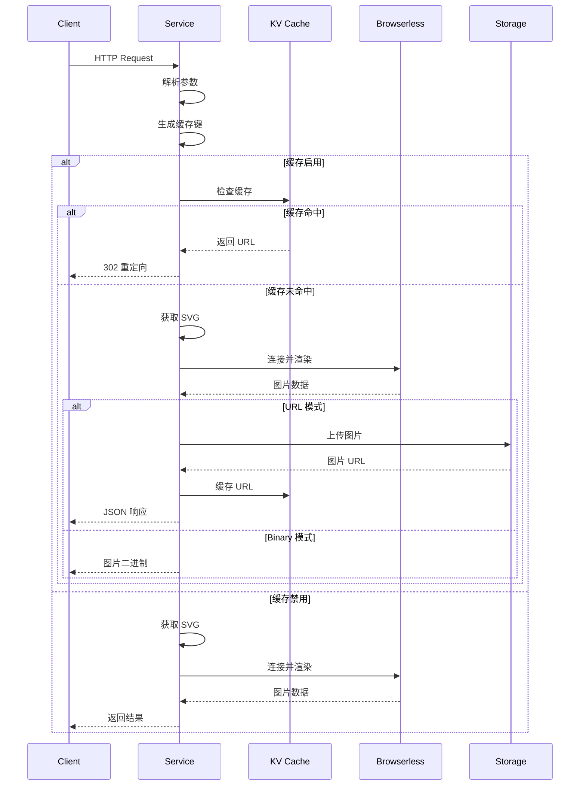
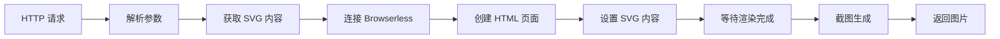
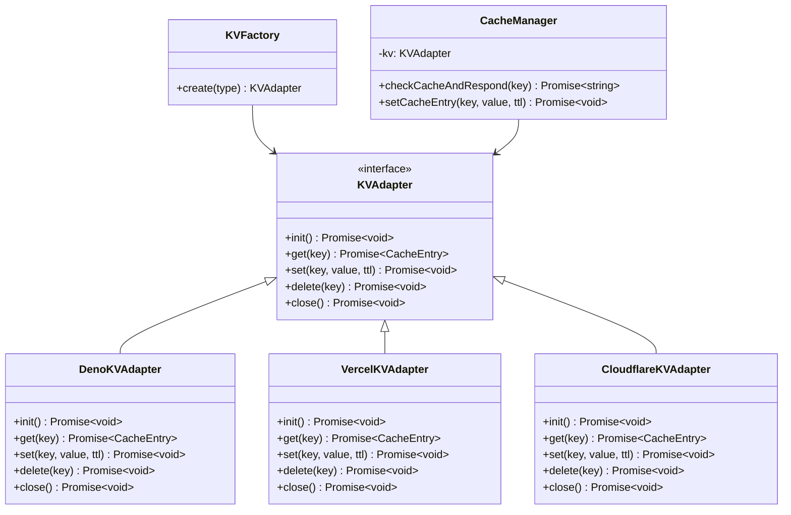
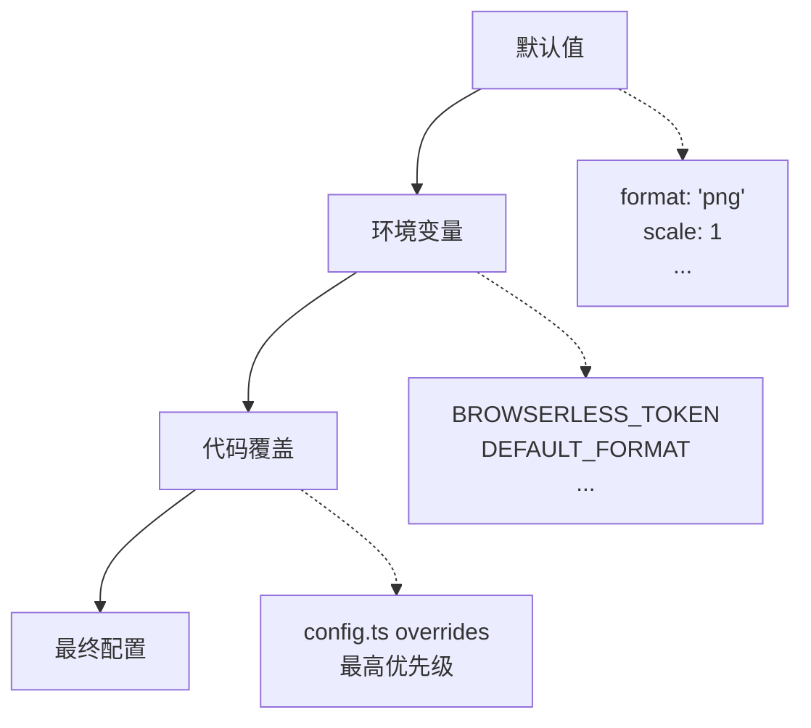

# 技术设计文档

本文档描述 SVG2IMG 的核心技术架构和设计决策。

> **用户指南**: 使用说明请查看 [README.md](../README.md) | **API 参考**: [API.md](API.md) | **部署指南**: [DEPLOYMENT.md](DEPLOYMENT.md)

## 📐 设计原则

- **简单直接**: 专注 SVG 转图片核心功能
- **无状态**: 适合边缘计算和云函数环境
- **可扩展**: 模块化设计，支持多平台部署
- **性能优先**: 智能缓存，减少重复渲染

## 🏗️ 系统架构

### 核心技术栈

```
运行时: Deno (原生支持 TypeScript)
渲染引擎: Browserless + Puppeteer
存储: Supabase Storage (URL 模式)
缓存: KV 存储 (Deno KV/Vercel KV/Cloudflare KV)
```

### 模块设计

```
├── index.ts          # HTTP 服务 + 主处理逻辑
├── config.ts         # 配置管理（三级配置系统）
├── utils.ts          # 工具函数 + 缓存系统
└── deps.ts          # 依赖管理
```

## 🔄 处理流程

### 请求处理链路



### SVG 渲染流程



## 🗄️ 缓存系统

### 架构设计



### 缓存策略

**缓存键生成**:
```typescript
// 基于所有渲染参数的 SHA-256 哈希
const params = { svg_content, format, scale, width, height, ... };
const cacheKey = generateParamsHash(params);
```

**TTL 同步**:
- 缓存过期时间 = Storage URL 过期时间
- 确保缓存的 URL 始终有效

**平台适配**:
- ✅ **Deno KV**: 完全实现
- 🚧 **Vercel KV**: 接口定义完成，实现待完成  
- 🚧 **Cloudflare KV**: 接口定义完成，实现待完成

## ⚙️ 配置系统

### 三级配置优先级



### Token 池管理

```typescript
class TokenManager {
  // 支持多 Token 轮询
  private tokens: string[] = CONFIG.BROWSERLESS.TOKENS;
  private failedTokens: Map<string, number> = new Map();
  
  getAvailableToken(): string {
    // 时间戳轮询 + 故障排除
  }
  
  markTokenFailed(token: string): void {
    // 标记失败 Token，1分钟后恢复
  }
}
```

## 🛡️ 安全设计

### 域名控制

```typescript
// 白名单模式
if (ALLOWED_DOMAINS.length > 0 && !ALLOWED_DOMAINS.includes(hostname)) {
  throw createError("DOMAIN_NOT_ALLOWED");
}

// 黑名单模式
if (BLOCKED_DOMAINS.includes(hostname)) {
  throw createError("DOMAIN_BLOCKED");
}
```

### 输入验证

```typescript
// 参数范围验证
const validation = {
  scale: (v: number) => v >= 0.1 && v <= 10,
  width: (v: number) => v >= 1 && v <= CONFIG.LIMITS.MAX_WIDTH,
  height: (v: number) => v >= 1 && v <= CONFIG.LIMITS.MAX_HEIGHT,
  quality: (v: number) => v >= 1 && v <= 100,
};

// SVG 内容限制
if (svgContent.length > CONFIG.LIMITS.MAX_SVG_SIZE) {
  throw createError("SVG_TOO_LARGE");
}
```

## 🚀 性能优化

### 资源管理

```typescript
// 确保浏览器实例清理
try {
  const browser = await puppeteer.connect({...});
  const page = await browser.newPage();
  // 处理逻辑
} finally {
  if (browser) await browser.close(); // 防止内存泄漏
}
```

### 超时控制

```typescript
// 多层次超时
const timeout = CONFIG.LIMITS.TIMEOUT; // 30秒

// HTTP 请求级别
const controller = new AbortController();
setTimeout(() => controller.abort(), timeout);

// Puppeteer 操作级别  
await page.goto(url, { timeout: timeout / 2 });
await page.waitForTimeout(waitFor);
```

## 🌐 部署适配

### 平台特性

| 平台 | KV 缓存 | 配置方式 | 特点 |
|------|---------|----------|------|
| **Deno Deploy** | ✅ Deno KV | 环境变量 | 原生支持，性能最佳 |
| **Supabase** | ❌ | 代码覆盖 | Storage 集成良好 |
| **Vercel** | 🚧 Vercel KV | 环境变量 | Edge Runtime |
| **Cloudflare** | 🚧 CF KV | 环境变量 | 全球边缘节点 |

### 环境检测

```typescript
// 运行时环境检测
const platform = {
  isDeno: typeof Deno !== "undefined",
  isVercel: !!process?.env?.VERCEL,
  isCloudflare: !!globalThis?.caches,
  isSupabase: !!Deno?.env?.get("SUPABASE_URL"),
};

// 自动适配配置
if (platform.isDeno && typeof Deno.openKv === "function") {
  // 启用 Deno KV 缓存
}
```

## 🔧 扩展点

### 新平台适配

1. **实现 KVAdapter 接口**
2. **添加平台检测逻辑**  
3. **更新 KVFactory**
4. **添加配置文档**

### 新功能扩展

- **图片后处理**: 在 `renderSvgToImage` 后添加处理步骤
- **批量处理**: 扩展 POST 接口支持多个 SVG
- **Webhook**: 异步处理完成后回调

## 📊 监控点

### 关键指标

- **响应时间**: 平均 < 2s
- **成功率**: > 99.5%
- **缓存命中率**: > 80%（Deno 平台）
- **Browserless 用量**: 监控 Token 使用情况

### 错误追踪

```typescript
// 结构化错误信息
class SVG2ImageError extends Error {
  constructor(
    public code: string,
    message: string,
    public httpStatus: number = 500
  ) {
    super(message);
  }
}

// 错误响应标准化
const errorResponse = {
  success: false,
  error: {
    code: error.code,
    message: error.message,
    timestamp: new Date().toISOString(),
  }
};
```

这个技术设计文档专注于架构决策和核心实现原理，为维护者和扩展开发提供技术参考。